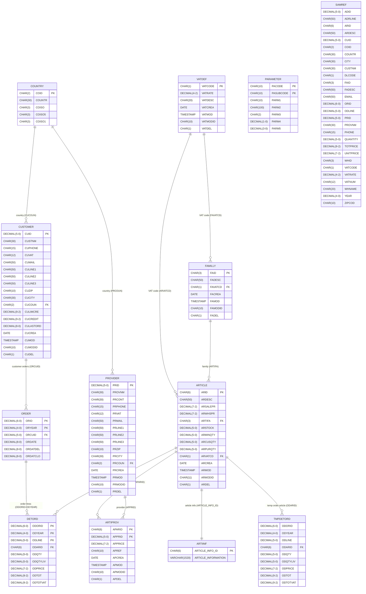

# /erd SAMCO

---

**Status:** active  **Date:** 2026-09-29

---

### 👤 User

# Generate Entity Relationship Diagram (ERD)

You are tasked with generating a comprehensive Entity Relationship Diagram (ERD) in Mermaid format for Db2 for i database tables.

## Required Skills

First, load the following skill to gain access to system catalog documentation:

**db2-system-catalog** - Provides comprehensive reference for QSYS2 catalog views

## Step 1: Determine Scope

If the user provided a specific table or schema:
- Parse the input (formats: SCHEMA.TABLE, LIBRARY/FILE, or just SCHEMA)
- Focus on the specified table and its related tables (via foreign keys)
- Include all parent tables (referenced by foreign keys) and child tables (referencing via foreign keys)

If no specific table was provided:
- Ask the user which schema/library they want to analyze
- Ask if they want all tables or specific tables
- Confirm the scope before proceeding

## Step 2: Query the System Catalog

Use the **execute_sql_statement** tool to query the following QSYS2 catalog views:

### Query 1: Get Table List
~~~sql
SELECT TABLE_SCHEMA, TABLE_NAME, TABLE_TYPE, LONG_COMMENT
FROM QSYS2.SYSTABLES
WHERE TABLE_SCHEMA = '<target_schema>'
  AND TABLE_TYPE IN ('T', 'P')
ORDER BY TABLE_NAME;
~~~

**Note on TABLE_TYPE values (per QSYS2.SYSTABLES documentation):**
- **'T'** = SQL Table (created with CREATE TABLE)
- **'P'** = Physical File (created with CRTPF or DDS)
- **'L'** = Logical File (not included - these are views over physical files)
- **'V'** = View (created with CREATE VIEW)
- **'A'** = Alias
- **'M'** = Materialized Query Table

**Important:** Physical files ('P') with logical files built over them may have additional access paths and selection criteria that are not captured in the base table structure. The ERD shows the base physical file structure only. For complete understanding of data access patterns involving logical files, refer to QSYS2.SYSFILES view which includes logical file metadata.

### Query 2: Get All Columns with Data Types
~~~sql
SELECT 
  c.TABLE_SCHEMA,
  c.TABLE_NAME,
  c.COLUMN_NAME,
  c.ORDINAL_POSITION,
  c.DATA_TYPE,
  c.LENGTH,
  c.NUMERIC_PRECISION,
  c.NUMERIC_SCALE,
  c.IS_NULLABLE,
  c.LONG_COMMENT,
  c.ALLOCATE,
  c.SECURE
FROM QSYS2.SYSCOLUMNS2 c
WHERE c.TABLE_SCHEMA = '<target_schema>'
  AND c.TABLE_NAME IN (<table_list>)
ORDER BY c.TABLE_NAME, c.ORDINAL_POSITION;
~~~

### Query 3: Get All Constraints
~~~sql
SELECT 
  cst.CONSTRAINT_SCHEMA,
  cst.CONSTRAINT_NAME,
  cst.CONSTRAINT_TYPE,
  cst.TABLE_SCHEMA,
  cst.TABLE_NAME,
  cst.CONSTRAINT_KEYS,
  cst.CONSTRAINT_STATE,
  cst.ENABLED,
  col.COLUMN_NAME
FROM QSYS2.SYSCST cst
JOIN QSYS2.SYSCSTCOL col
  ON cst.CONSTRAINT_SCHEMA = col.CONSTRAINT_SCHEMA
 AND cst.CONSTRAINT_NAME = col.CONSTRAINT_NAME
WHERE cst.TABLE_SCHEMA = '<target_schema>'
  AND cst.CONSTRAINT_TYPE IN ('PRIMARY KEY', 'UNIQUE', 'FOREIGN KEY')
ORDER BY cst.TABLE_NAME, cst.CONSTRAINT_TYPE, col.COLUMN_NAME;
~~~

### Query 4: Get Foreign Key Relationships
~~~sql
SELECT 
  ref.CONSTRAINT_SCHEMA AS FK_CONSTRAINT_SCHEMA,
  ref.CONSTRAINT_NAME AS FK_CONSTRAINT_NAME,
  fk_cst.TABLE_SCHEMA AS FK_TABLE_SCHEMA,
  fk_cst.TABLE_NAME AS FK_TABLE_NAME,
  fk_col.COLUMN_NAME AS FK_COLUMN_NAME,
  ref.UNIQUE_CONSTRAINT_SCHEMA AS PK_CONSTRAINT_SCHEMA,
  ref.UNIQUE_CONSTRAINT_NAME AS PK_CONSTRAINT_NAME,
  pk_cst.TABLE_SCHEMA AS PK_TABLE_SCHEMA,
  pk_cst.TABLE_NAME AS PK_TABLE_NAME,
  pk_col.COLUMN_NAME AS PK_COLUMN_NAME,
  ref.DELETE_RULE,
  ref.UPDATE_RULE,
  ref.COLUMN_COUNT
FROM QSYS2.SYSREFCST ref
JOIN QSYS2.SYSCST fk_cst
  ON ref.CONSTRAINT_SCHEMA = fk_cst.CONSTRAINT_SCHEMA
 AND ref.CONSTRAINT_NAME = fk_cst.CONSTRAINT_NAME
JOIN QSYS2.SYSCST pk_cst
  ON ref.UNIQUE_CONSTRAINT_SCHEMA = pk_cst.CONSTRAINT_SCHEMA
 AND ref.UNIQUE_CONSTRAINT_NAME = pk_cst.CONSTRAINT_NAME
JOIN QSYS2.SYSCSTCOL fk_col
  ON ref.CONSTRAINT_SCHEMA = fk_col.CONSTRAINT_SCHEMA
 AND ref.CONSTRAINT_NAME = fk_col.CONSTRAINT_NAME
JOIN QSYS2.SYSCSTCOL pk_col
  ON ref.UNIQUE_CONSTRAINT_SCHEMA = pk_col.CONSTRAINT_SCHEMA
 AND ref.UNIQUE_CONSTRAINT_NAME = pk_col.CONSTRAINT_NAME
WHERE fk_cst.TABLE_SCHEMA = '<target_schema>'
   OR pk_cst.TABLE_SCHEMA = '<target_schema>'
ORDER BY fk_cst.TABLE_NAME, ref.CONSTRAINT_NAME;
~~~

## Step 3: Build the Mermaid ERD

Using the query results, construct a Mermaid erDiagram with the following structure:

### Entity Definition Format
~~~
ENTITY_NAME {
    DATA_TYPE(LENGTH[-SCALE]) COLUMN_NAME [MARKER]
}
~~~

Where:
- **ENTITY_NAME**: Table name (use uppercase or original case from SYSTABLES)
- **DATA_TYPE**: Exact Db2 for i data type from SYSCOLUMNS.DATA_TYPE
- **LENGTH**: From SYSCOLUMNS.LENGTH for CHAR, VARCHAR, etc.
- **SCALE**: From SYSCOLUMNS.NUMERIC_SCALE for DECIMAL, NUMERIC
- **COLUMN_NAME**: From SYSCOLUMNS.COLUMN_NAME
- **MARKER**: PK (Primary Key), FK (Foreign Key), or UQ (Unique)

### Data Type Formatting Rules

**Character Types:**
- CHAR(n) - Fixed-length character
- VARCHAR(n) - Variable-length character
- CLOB - Character large object (omit length)
- GRAPHIC(n) - Fixed-length graphic
- VARGRAPHIC(n) - Variable-length graphic
- DBCLOB - Double-byte character large object (omit length)

**Numeric Types:**
- SMALLINT - 2-byte integer (no length)
- INTEGER - 4-byte integer (no length)
- BIGINT - 8-byte integer (no length)
- DECIMAL(p-s) - Packed decimal with precision and scale
- NUMERIC(p-s) - Zoned decimal with precision and scale
- FLOAT - Floating point (specify precision if needed)
- DECFLOAT(16) or DECFLOAT(34) - Decimal floating-point

**Date/Time Types:**
- DATE - Date value (no length)
- TIME - Time value (no length)
- TIMESTAMP(p) - Timestamp with optional fractional seconds precision

**Binary Types:**
- BINARY(n) - Fixed-length binary
- VARBINARY(n) - Variable-length binary
- BLOB - Binary large object (omit length)

**Other Types:**
- ROWID - Row identifier (no length)
- DATALINK - Datalink value
- XML - XML document (no length)
- BOOLEAN - Boolean value (no length, 7.5 and above only)

### Relationship Format
~~~
PARENT_TABLE ||--o{ CHILD_TABLE : "relationship_description"
~~~

**Cardinality Notation:**
- ||--|| : One to exactly one
- ||--o| : One to zero or one
- ||--o{ : One to zero or many (most common for foreign keys)
- }o--o{ : Zero or many to zero or many
- }|--|{ : One or many to one or many

**When showing precision and scale**, use a dash: 15-2, 11-2, 5-1

**Choose cardinality based on:**
- Foreign key nullability (IS_NULLABLE = 'Y' allows zero)
- Business logic (if FK is NOT NULL, use }| instead of }o)

### Example Output

~~~mermaid
erDiagram
    CUSTOMER {
        CHAR(10) CUSTID PK
        VARCHAR(50) CUSTNAME
        VARCHAR(100) ADDRESS
        CHAR(2) STATE
        CHAR(10) ZIPCODE
        DATE CREATED_DATE
        DECIMAL(15-2) CREDIT_LIMIT
    }
    
    ORDERS {
        BIGINT ORDERID PK
        CHAR(10) CUSTID FK
        DATE ORDER_DATE
        DECIMAL(15-2) TOTAL_AMOUNT
        VARCHAR(20) ORDER_STATUS
        TIMESTAMP(6) CREATED_TS
    }
    
    ORDER_ITEMS {
        BIGINT ITEM_ID PK
        BIGINT ORDERID FK
        VARCHAR(50) PRODUCT_CODE FK
        INTEGER QUANTITY
        DECIMAL(15-2) UNIT_PRICE
        DECIMAL(15-2) LINE_TOTAL
    }
    
    PRODUCTS {
        VARCHAR(50) PRODUCT_CODE PK
        VARCHAR(200) PRODUCT_NAME
        DECIMAL(15-2) LIST_PRICE
        INTEGER STOCK_QTY
        CHAR(1) ACTIVE_FLAG
    }
    
    CUSTOMER ||--o{ ORDERS : "places"
    ORDERS ||--o{ ORDER_ITEMS : "contains"
    PRODUCTS ||--o{ ORDER_ITEMS : "is_ordered_as"
~~~

## Step 4: Output Requirements

1. **Output only the Mermaid code block** - No explanatory text before or after unless requested
2. **Use proper syntax** - Ensure the diagram is valid Mermaid erDiagram syntax
3. **Preserve data types exactly** - Use the exact data types, lengths, and scales from Db2 for i
4. **Include all constraints** - Mark PK, FK, and UQ appropriately
5. **Show all relationships** - Include all foreign key relationships discovered
6. **Maintain readability** - Use consistent formatting and indentation

## Important Notes

- If foreign key relationships reference tables outside the target schema, include those external tables in the diagram
- If a constraint is in CHECK PENDING state (CHECK_PENDING = 'Y'), add a comment noting this
- If a constraint is DEFINED but not ESTABLISHED (CONSTRAINT_STATE = 'DEFINED'), note that the parent table may not exist
- Handle cases where DELETE_RULE or UPDATE_RULE might be CASCADE, SET NULL, or RESTRICT
- Use table comments from SYSTABLES.LONG_COMMENT if available to enrich relationship descriptions

## Error Handling

If queries fail or return no data:
- Verify the schema/library name exists and is accessible
- Check that the user has appropriate authority to query QSYS2 catalog views
- Confirm the IBM i system is connected via Code for IBM i extension
- Provide helpful error messages with suggested corrections

Begin by confirming the scope with the user, then proceed with the queries and diagram generation.

SAMCO

---

### 🤖 Assistant

> 🔧 called: update_todo_list

> 🔧 **update_todo_list** — 
[-] Query SAMCO schema tables from QSYS2 catalog
[ ] Query all columns with data types
[ ] Query all constraints (PK, UK, FK)
[ ] Query foreign key relationships
[ ] Build Mermaid ERD diagram
[ ] Output the final ERD

### 🤖 Assistant

> 🔧 called: execute_sql_statement

> 🔧 **execute_sql_statement** — SELECT TABLE_SCHEMA, TABLE_NAME, TABLE_TYPE, LONG_COMMENT
FROM QSYS2.SYSTABLES
WHERE TABLE_SCHEMA = 'SAMCO'
  AND TABLE_TYPE IN ('T', 'P')
ORDER BY TABLE_NAME

### 🤖 Assistant

> 🔧 called: execute_sql_statement

> 🔧 **execute_sql_statement** — SELECT 
  c.TABLE_SCHEMA,
  c.TABLE_NAME,
  c.COLUMN_NAME,
  c.ORDINAL_POSITION,
  c.DATA_TYPE,
  c.LENGTH,
  c.NUMERIC_PRECISION,
  c.NUMERIC_SCALE,
  c.IS_NULLABLE,
  c.LONG_COMMENT,
  c.ALLOCATE,
  c.SECURE
FROM QSYS2.SYSCOLUMNS2 c
WHERE c.TABLE_SCHEMA = 'SAMCO'
  AND c.TABLE_NAME IN ('ARTICLE','ARTIINF','ARTIPROV','COUNTRY','CUSTOMER','DETORD','FAMILLY','ORDER','PARAMETER','PROVIDER','SAMREF','TMPDETORD','VATDEF')
ORDER BY c.TABLE_NAME, c.ORDINAL_POSITION

### 🤖 Assistant

> 🔧 called: execute_sql_statement

> 🔧 **execute_sql_statement** — SELECT 
  c.TABLE_SCHEMA,
  c.TABLE_NAME,
  c.COLUMN_NAME,
  c.ORDINAL_POSITION,
  c.DATA_TYPE,
  c.LENGTH,
  c.NUMERIC_PRECISION,
  c.NUMERIC_SCALE,
  c.IS_NULLABLE,
  c.LONG_COMMENT
FROM QSYS2.SYSCOLUMNS2 c
WHERE c.TABLE_SCHEMA = 'SAMCO'
  AND c.TABLE_NAME IN ('ARTICLE','ARTIINF','ARTIPROV','COUNTRY','CUSTOMER','DETORD','FAMILLY','ORDER','PARAMETER','PROVIDER','SAMREF','TMPDETORD','VATDEF')
ORDER BY c.TABLE_NAME, c.ORDINAL_POSITION
LIMIT 100 OFFSET 100

### 🤖 Assistant

> 🔧 called: execute_sql_statement

> 🔧 **execute_sql_statement** — SELECT 
  cst.CONSTRAINT_SCHEMA,
  cst.CONSTRAINT_NAME,
  cst.CONSTRAINT_TYPE,
  cst.TABLE_SCHEMA,
  cst.TABLE_NAME,
  cst.CONSTRAINT_STATE,
  cst.ENABLED,
  col.COLUMN_NAME
FROM QSYS2.SYSCST cst
JOIN QSYS2.SYSCSTCOL col
  ON cst.CONSTRAINT_SCHEMA = col.CONSTRAINT_SCHEMA
 AND cst.CONSTRAINT_NAME = col.CONSTRAINT_NAME
WHERE cst.TABLE_SCHEMA = 'SAMCO'
  AND cst.CONSTRAINT_TYPE IN ('PRIMARY KEY', 'UNIQUE', 'FOREIGN KEY')
ORDER BY cst.TABLE_NAME, cst.CONSTRAINT_TYPE, col.COLUMN_NAME

### 🤖 Assistant

> 🔧 called: execute_sql_statement

> 🔧 **execute_sql_statement** — SELECT 
  ref.CONSTRAINT_SCHEMA AS FK_CONSTRAINT_SCHEMA,
  ref.CONSTRAINT_NAME AS FK_CONSTRAINT_NAME,
  fk_cst.TABLE_SCHEMA AS FK_TABLE_SCHEMA,
  fk_cst.TABLE_NAME AS FK_TABLE_NAME,
  fk_col.COLUMN_NAME AS FK_COLUMN_NAME,
  ref.UNIQUE_CONSTRAINT_SCHEMA AS PK_CONSTRAINT_SCHEMA,
  ref.UNIQUE_CONSTRAINT_NAME AS PK_CONSTRAINT_NAME,
  pk_cst.TABLE_SCHEMA AS PK_TABLE_SCHEMA,
  pk_cst.TABLE_NAME AS PK_TABLE_NAME,
  pk_col.COLUMN_NAME AS PK_COLUMN_NAME,
  ref.DELETE_RULE,
  ref.UPDATE_RULE
FROM QSYS2.SYSREFCST ref
JOIN QSYS2.SYSCST fk_cst
  ON ref.CONSTRAINT_SCHEMA = fk_cst.CONSTRAINT_SCHEMA
 AND ref.CONSTRAINT_NAME = fk_cst.CONSTRAINT_NAME
JOIN QSYS2.SYSCST pk_cst
  ON ref.UNIQUE_CONSTRAINT_SCHEMA = pk_cst.CONSTRAINT_SCHEMA
 AND ref.UNIQUE_CONSTRAINT_NAME = pk_cst.CONSTRAINT_NAME
JOIN QSYS2.SYSCSTCOL fk_col
  ON ref.CONSTRAINT_SCHEMA = fk_col.CONSTRAINT_SCHEMA
 AND ref.CONSTRAINT_NAME = fk_col.CONSTRAINT_NAME
JOIN QSYS2.SYSCSTCOL pk_col
  ON ref.UNIQUE_CONSTRAINT_SCHEMA = pk_col.CONSTRAINT_SCHEMA
 AND ref.UNIQUE_CONSTRAINT_NAME = pk_col.CONSTRAINT_NAME
WHERE fk_cst.TABLE_SCHEMA = 'SAMCO'
   OR pk_cst.TABLE_SCHEMA = 'SAMCO'
ORDER BY fk_cst.TABLE_NAME, ref.CONSTRAINT_NAME

### 🤖 Assistant

> 🔧 called: update_todo_list

> 🔧 **update_todo_list** — 
[x] Query SAMCO schema tables from QSYS2 catalog
[x] Query all columns with data types
[x] Query all constraints (PK, UK, FK) - none defined in catalog
[x] Query foreign key relationships - none defined in catalog
[-] Build Mermaid ERD diagram (inferring relationships from column naming conventions)
[ ] Output the final ERD

### 🤖 Assistant

> 🔧 called: update_todo_list

No formal constraints (PKs, FKs, UKs) are registered in the QSYS2 catalog for SAMCO — this is typical of DDS-defined physical files which rely on programming logic rather than SQL constraints. I'll infer the relationships from column naming patterns and the data model.

Here's the complete ERD for the SAMCO schema:

> 🔧 **update_todo_list** — 
[x] Query SAMCO schema tables from QSYS2 catalog
[x] Query all columns with data types
[x] Query all constraints (PK, UK, FK) - none defined in catalog
[x] Query foreign key relationships - none defined in catalog
[x] Build Mermaid ERD diagram (inferring relationships from column naming conventions)
[-] Output the final ERD

### 🤖 Assistant

---

**Notes on the SAMCO ERD:**

- **No SQL constraints are defined** — SAMCO uses DDS-defined physical files (type `P`). Keys and relationships are enforced at the application level rather than through SQL referential integrity. All PK/FK markers and relationships above are **inferred** from column naming conventions and business logic.
- **SAMREF** appears to be a denormalised reporting/reference view-like flat table (it duplicates columns from many entities), not a transactional table. No relationships are drawn from it.
- **TMPDETORD** mirrors `DETORD` and is likely a working/staging area during order processing; no PK is defined at the database level.
- **PARAMETER** uses a composite key `(PACODE, PASUBCODE)` — a common IBM i pattern for configuration lookups.
- **QSQDSRC** was excluded as it is a source physical file (used for SQL source storage), not a business data table.