# Give me a report on the usage of current indexes

---

**Status:** active  **Date:** 2026-10-01

---

### 👤 User

Give me a report on the usage of current indexes

---

### 🤖 Assistant

> 🔧 called: search_sql_examples, get_schema_info


> 🔧 **search_sql_examples** — QSYS2.INDEX_STATISTICS

> 🔧 **get_schema_info** — SAMCO

### 🤖 Assistant

> 🔧 called: search_sql_examples, search_ibm_i_docs_with_rag


> 🔧 **search_sql_examples** — QSYS2.SYSINDEXSTAT

> 🔧 **search_ibm_i_docs_with_rag** — QSYS2 index statistics usage SQL service IBM i

### 🤖 Assistant

> 🔧 called: search_ibm_i_docs_with_rag


> 🔧 **search_ibm_i_docs_with_rag** — QSYS2.SYSINDEXSTAT columns table index statistics query use count last used

### 🤖 Assistant

> 🔧 called: execute_sql_statement

Now I have all the information needed. Let me run the query against the SAMCO library.

> 🔧 **execute_sql_statement** — 
SELECT
    INDEX_SCHEMA,
    INDEX_NAME,
    TABLE_NAME,
    INDEX_TYPE,
    COLUMN_NAMES,
    NUMBER_KEY_COLUMNS,
    NUMBER_KEYS,
    QUERY_USE_COUNT,
    QUERY_STATISTICS_COUNT,
    LAST_QUERY_USE,
    LAST_STATISTICS_USE,
    LAST_USED_TIMESTAMP,
    DAYS_USED_COUNT,
    LAST_RESET_TIMESTAMP,
    INDEX_SIZE,
    NUMBER_PAGES
FROM QSYS2.SYSINDEXSTAT
WHERE INDEX_SCHEMA = 'SAMCO'
ORDER BY QUERY_USE_COUNT DESC, INDEX_NAME


### 🤖 Assistant

> 🔧 called: execute_sql_statement


> 🔧 **execute_sql_statement** — 
SELECT COLUMN_NAME, DATA_TYPE
FROM QSYS2.SYSCOLUMNS
WHERE TABLE_SCHEMA = 'QSYS2' AND TABLE_NAME = 'SYSINDEXSTAT'
ORDER BY ORDINAL_POSITION


### 🤖 Assistant

> 🔧 called: execute_sql_statement


> 🔧 **execute_sql_statement** — 
SELECT
    INDEX_NAME,
    TABLE_NAME,
    OWNING_INDEX_TYPE            AS INDEX_TYPE,
    COLUMN_NAMES,
    NUMBER_KEY_COLUMNS,
    NUMBER_KEYS,
    QUERY_USE_COUNT,
    QUERY_STATISTICS_COUNT,
    LAST_QUERY_USE,
    LAST_STATISTICS_USE,
    LAST_USED_TIMESTAMP,
    DAYS_USED_COUNT,
    LAST_RESET_TIMESTAMP,
    INDEX_VALID,
    "UNIQUE",
    INDEX_SIZE,
    NUMBER_PAGES
FROM QSYS2.SYSINDEXSTAT
WHERE INDEX_SCHEMA = 'SAMCO'
ORDER BY QUERY_USE_COUNT DESC, INDEX_NAME


### 🤖 Assistant

> 🔧 called: execute_sql_statement


> 🔧 **execute_sql_statement** — 
SELECT COUNT(*) AS TOTAL_INDEXES
FROM QSYS2.SYSINDEXSTAT
WHERE INDEX_SCHEMA = 'SAMCO'


### 🤖 Assistant

> 🔧 called: execute_sql_statement


> 🔧 **execute_sql_statement** — 
SELECT DISTINCT INDEX_SCHEMA
FROM QSYS2.SYSINDEXSTAT
WHERE INDEX_SCHEMA LIKE 'SAM%'


### 🤖 Assistant

> 🔧 called: execute_sql_statement


> 🔧 **execute_sql_statement** — 
SELECT DISTINCT SYSTEM_TABLE_SCHEMA, INDEX_SCHEMA
FROM QSYS2.SYSINDEXSTAT
WHERE SYSTEM_TABLE_SCHEMA = 'SAMCO'
FETCH FIRST 5 ROWS ONLY


### 🤖 Assistant

> 🔧 called: execute_sql_statement


> 🔧 **execute_sql_statement** — 
SELECT COUNT(*) AS TOTAL
FROM QSYS2.SYSINDEXSTAT
WHERE SYSTEM_TABLE_SCHEMA = 'SAMCO'
   OR INDEX_SCHEMA = 'SAMCO'


### 🤖 Assistant

> 🔧 called: execute_sql_statement

The `QSYS2.SYSINDEXSTAT` view tracks SQL indexes only. Let me check what objects actually exist in SAMCO — logical files (which are the traditional IBM i index equivalent) and any SQL indexes.

> 🔧 **execute_sql_statement** — 
SELECT
    o.OBJNAME         AS OBJECT_NAME,
    o.OBJTYPE         AS OBJECT_TYPE,
    o.OBJATTR         AS OBJECT_ATTR,
    o.OBJTEXT         AS DESCRIPTION,
    o.OBJCREATED      AS CREATED,
    o.LAST_USED_TIMESTAMP,
    o.DAYS_USED_COUNT,
    o.LAST_RESET_TIMESTAMP
FROM TABLE(QSYS2.OBJECT_STATISTICS('SAMCO', '*ALL')) AS o
WHERE o.OBJTYPE IN ('*FILE')
  AND o.OBJATTR IN ('LF', 'KEYPHYSF')
ORDER BY o.DAYS_USED_COUNT DESC NULLS LAST, o.LAST_USED_TIMESTAMP DESC NULLS LAST


### 🤖 Assistant

> 🔧 called: execute_sql_statement


> 🔧 **execute_sql_statement** — 
SELECT
    o.OBJNAME         AS OBJECT_NAME,
    o.OBJTYPE         AS OBJECT_TYPE,
    o.OBJATTR         AS OBJECT_ATTR,
    o.OBJTEXT         AS DESCRIPTION,
    o.OBJCREATED      AS CREATED,
    o.LAST_USED_TIMESTAMP,
    o.DAYS_USED_COUNT,
    o.LAST_RESET_TIMESTAMP
FROM TABLE(QSYS2.OBJECT_STATISTICS('SAMCO', '*ALL')) AS o
WHERE o.OBJTYPE IN ('*FILE')
  AND o.OBJATTR IN ('LF', 'KEYPHYSF')
ORDER BY o.DAYS_USED_COUNT DESC, o.LAST_USED_TIMESTAMP DESC


### 🤖 Assistant

> 🔧 called: execute_sql_statement


> 🔧 **execute_sql_statement** — 
SELECT COLUMN_NAME, DATA_TYPE
FROM QSYS2.SYSCOLUMNS
WHERE TABLE_SCHEMA = 'QSYS2' AND TABLE_NAME = 'OBJECT_STATISTICS'
ORDER BY ORDINAL_POSITION
FETCH FIRST 30 ROWS ONLY


### 🤖 Assistant

> 🔧 called: execute_sql_statement


> 🔧 **execute_sql_statement** — 
SELECT *
FROM TABLE(QSYS2.OBJECT_STATISTICS('SAMCO', '*FILE')) AS o
FETCH FIRST 1 ROW ONLY


### 🤖 Assistant

> 🔧 called: execute_sql_statement

Now I have the correct column names. Let me run the full index usage report using `OBJATTRIBUTE` to filter for logical files.

> 🔧 **execute_sql_statement** — 
SELECT
    o.OBJNAME             AS INDEX_NAME,
    o.OBJATTRIBUTE        AS FILE_TYPE,
    o.OBJTEXT             AS DESCRIPTION,
    o.OBJCREATED          AS CREATED,
    o.LAST_USED_TIMESTAMP AS LAST_USED,
    o.DAYS_USED_COUNT     AS DAYS_USED,
    o.LAST_RESET_TIMESTAMP AS LAST_STATS_RESET
FROM TABLE(QSYS2.OBJECT_STATISTICS('SAMCO', '*FILE')) AS o
WHERE o.OBJATTRIBUTE IN ('LF')
ORDER BY o.DAYS_USED_COUNT DESC, o.LAST_USED_TIMESTAMP DESC


### 🤖 Assistant

> 🔧 called: execute_sql_statement

Now let me also get the key fields for each of these logical files to make the report more meaningful:

> 🔧 **execute_sql_statement** — 
SELECT
    i.INDEX_NAME,
    i.TABLE_NAME           AS BASE_TABLE,
    i.COLUMN_NAMES         AS KEY_COLUMNS,
    i.NUMBER_KEY_COLUMNS,
    i.NUMBER_KEYS,
    i."UNIQUE"             AS IS_UNIQUE,
    i.INDEX_VALID,
    i.QUERY_USE_COUNT,
    i.QUERY_STATISTICS_COUNT,
    i.LAST_QUERY_USE,
    i.LAST_STATISTICS_USE,
    i.LAST_USED_TIMESTAMP,
    i.DAYS_USED_COUNT,
    i.LAST_RESET_TIMESTAMP
FROM QSYS2.SYSINDEXSTAT i
WHERE i.SYSTEM_INDEX_SCHEMA = 'SAMCO'
ORDER BY i.QUERY_USE_COUNT DESC, i.INDEX_NAME


### 🤖 Assistant

> 🔧 called: execute_sql_statement


> 🔧 **execute_sql_statement** — 
SELECT
    f.TABLE_NAME          AS LOGICAL_FILE,
    f.BASE_TABLE_NAME     AS BASE_TABLE,
    k.COLUMN_NAME         AS KEY_COLUMN,
    k.ORDINAL_POSITION    AS KEY_POSITION,
    k.ORDERING            AS SORT_ORDER
FROM QSYS2.SYSKEYS k
JOIN QSYS2.SYSFILES f
    ON f.TABLE_SCHEMA = k.TABLE_SCHEMA
    AND f.TABLE_NAME = k.TABLE_NAME
WHERE k.TABLE_SCHEMA = 'SAMCO'
  AND f.FILE_TYPE = 'L'
ORDER BY f.TABLE_NAME, k.ORDINAL_POSITION


### 🤖 Assistant

> 🔧 called: execute_sql_statement


> 🔧 **execute_sql_statement** — 
SELECT COLUMN_NAME FROM QSYS2.SYSCOLUMNS
WHERE TABLE_SCHEMA = 'QSYS2' AND TABLE_NAME = 'SYSFILES'
ORDER BY ORDINAL_POSITION
FETCH FIRST 20 ROWS ONLY


### 🤖 Assistant

> 🔧 called: execute_sql_statement


> 🔧 **execute_sql_statement** — 
-- Get logical files with their key columns
SELECT
    k.TABLE_NAME          AS LOGICAL_FILE,
    k.COLUMN_NAME         AS KEY_COLUMN,
    k.ORDINAL_POSITION    AS KEY_POSITION,
    k.ORDERING            AS SORT_ORDER
FROM QSYS2.SYSKEYS k
WHERE k.TABLE_SCHEMA = 'SAMCO'
ORDER BY k.TABLE_NAME, k.ORDINAL_POSITION


### 🤖 Assistant

> 🔧 called: execute_sql_statement


> 🔧 **execute_sql_statement** — 
SELECT COLUMN_NAME FROM QSYS2.SYSCOLUMNS
WHERE TABLE_SCHEMA = 'QSYS2' AND TABLE_NAME = 'SYSKEYS'
ORDER BY ORDINAL_POSITION


### 🤖 Assistant

> 🔧 called: execute_sql_statement


> 🔧 **execute_sql_statement** — 
SELECT
    k.SYSTEM_INDEX_NAME   AS LOGICAL_FILE,
    k.COLUMN_NAME         AS KEY_COLUMN,
    k.ORDINAL_POSITION    AS KEY_POSITION,
    k.ORDERING            AS SORT_ORDER
FROM QSYS2.SYSKEYS k
WHERE k.SYSTEM_INDEX_SCHEMA = 'SAMCO'
ORDER BY k.SYSTEM_INDEX_NAME, k.ORDINAL_POSITION


### 🤖 Assistant

> 🔧 called: execute_sql_statement


> 🔧 **execute_sql_statement** — 
SELECT
    k.INDEX_SCHEMA,
    k.INDEX_NAME,
    k.COLUMN_NAME,
    k.ORDINAL_POSITION,
    k.ORDERING
FROM QSYS2.SYSKEYS k
WHERE k.INDEX_SCHEMA = 'SAMCO'
ORDER BY k.INDEX_NAME, k.ORDINAL_POSITION


### 🤖 Assistant

> 🔧 called: execute_sql_statement


> 🔧 **execute_sql_statement** — 
SELECT *
FROM QSYS2.SYSKEYS
WHERE SYSTEM_INDEX_SCHEMA = 'SAMCO'
   OR INDEX_SCHEMA = 'SAMCO'
FETCH FIRST 5 ROWS ONLY


### 🤖 Assistant

> 🔧 called: execute_sql_statement

The SQL catalog views are not showing the DDS logical files from SAMCO. Let me check how SAMCO objects are indexed using `QSYS2.SYSTABLES`:

> 🔧 **execute_sql_statement** — 
SELECT
    TABLE_NAME,
    TABLE_TYPE,
    TABLE_SCHEMA,
    SYSTEM_TABLE_NAME,
    SYSTEM_TABLE_SCHEMA
FROM QSYS2.SYSTABLES
WHERE SYSTEM_TABLE_SCHEMA = 'SAMCO'
  AND TABLE_TYPE IN ('L', 'I', 'V')
ORDER BY TABLE_TYPE, TABLE_NAME


### 🤖 Assistant

> 🔧 called: execute_sql_statement

Good — now I can see all 12 logical files (TABLE_TYPE='L') and 2 views (TABLE_TYPE='V'). Now let me get their key columns using `QSYS2.SYSCST` / `QSYS2.SYSINDEXES`, along with detailed statistics:

> 🔧 **execute_sql_statement** — 
SELECT
    i.INDEX_NAME,
    i.TABLE_SCHEMA,
    i.TABLE_NAME     AS BASE_TABLE,
    i.UNIQUERULE     AS IS_UNIQUE,
    i.INDEX_TYPE,
    i.SYSTEM_INDEX_SCHEMA,
    i.SYSTEM_INDEX_NAME
FROM QSYS2.SYSINDEXES i
WHERE i.TABLE_SCHEMA = 'SAMCO'
ORDER BY i.INDEX_NAME


### 🤖 Assistant

> 🔧 called: execute_sql_statement


> 🔧 **execute_sql_statement** — 
SELECT *
FROM QSYS2.SYSINDEXES
WHERE TABLE_SCHEMA = 'SAMCO'
FETCH FIRST 2 ROWS ONLY


### 🤖 Assistant

> 🔧 called: execute_sql_statement


> 🔧 **execute_sql_statement** — 
-- Use QSYS2.SYSTABLES to get logical files and join with member-level key info via SYSPARTITIONINDEXSTAT
SELECT
    t.SYSTEM_TABLE_NAME           AS LOGICAL_FILE,
    t.BASE_TABLE_NAME             AS BASE_TABLE,
    t.NUMBER_KEY_FIELDS           AS NUM_KEYS,
    o.LAST_USED_TIMESTAMP         AS LAST_USED,
    o.DAYS_USED_COUNT,
    o.LAST_RESET_TIMESTAMP        AS STATS_RESET,
    t.TEXT_DESCRIPTION            AS DESCRIPTION
FROM QSYS2.SYSFILES t
JOIN TABLE(QSYS2.OBJECT_STATISTICS('SAMCO', '*FILE')) AS o
    ON o.OBJNAME = t.SYSTEM_TABLE_NAME
WHERE t.SYSTEM_TABLE_SCHEMA = 'SAMCO'
  AND t.FILE_TYPE = 'L'
ORDER BY o.DAYS_USED_COUNT DESC, o.LAST_USED_TIMESTAMP DESC


### 🤖 Assistant

> 🔧 called: execute_sql_statement


> 🔧 **execute_sql_statement** — 
SELECT COLUMN_NAME FROM QSYS2.SYSCOLUMNS
WHERE TABLE_SCHEMA = 'QSYS2' AND TABLE_NAME = 'SYSFILES'
ORDER BY ORDINAL_POSITION


### 🤖 Assistant

> 🔧 called: execute_sql_statement


> 🔧 **execute_sql_statement** — 
SELECT
    f.SYSTEM_TABLE_NAME           AS LOGICAL_FILE,
    f.BASED_ON_FILES              AS BASE_TABLE,
    f.NUMBER_KEY_FIELDS           AS NUM_KEY_FIELDS,
    f.TEXT_DESCRIPTION            AS DESCRIPTION,
    f.ACCESS_PATH_TYPE            AS ACCESS_TYPE,
    f.ACCESS_PATH_MAINTENANCE     AS MAINTENANCE,
    f.IS_JOIN_LOGICAL,
    f.SELECT_OMIT,
    o.LAST_USED_TIMESTAMP         AS LAST_USED,
    o.DAYS_USED_COUNT,
    o.LAST_RESET_TIMESTAMP        AS STATS_RESET
FROM QSYS2.SYSFILES f
JOIN TABLE(QSYS2.OBJECT_STATISTICS('SAMCO', '*FILE')) AS o
    ON o.OBJNAME = f.SYSTEM_TABLE_NAME
WHERE f.SYSTEM_TABLE_SCHEMA = 'SAMCO'
  AND f.FILE_TYPE = 'L'
ORDER BY o.DAYS_USED_COUNT DESC, o.LAST_USED_TIMESTAMP DESC


### 🤖 Assistant

> 🔧 called: execute_sql_statement


> 🔧 **execute_sql_statement** — 
SELECT COUNT(*) FROM QSYS2.SYSFILES WHERE SYSTEM_TABLE_SCHEMA = 'SAMCO'


### 🤖 Assistant

> 🔧 called: execute_sql_statement


> 🔧 **execute_sql_statement** — 
SELECT
    f.SYSTEM_TABLE_NAME,
    f.FILE_TYPE,
    f.BASED_ON_FILES,
    f.NUMBER_KEY_FIELDS,
    f.TEXT_DESCRIPTION,
    f.ACCESS_PATH_TYPE,
    f.ACCESS_PATH_MAINTENANCE,
    f.IS_JOIN_LOGICAL,
    f.SELECT_OMIT
FROM QSYS2.SYSFILES f
WHERE f.SYSTEM_TABLE_SCHEMA = 'SAMCO'
  AND f.FILE_TYPE = 'L'
ORDER BY f.SYSTEM_TABLE_NAME


### 🤖 Assistant

> 🔧 called: execute_sql_statement


> 🔧 **execute_sql_statement** — 
SELECT SYSTEM_TABLE_NAME, FILE_TYPE FROM QSYS2.SYSFILES
WHERE SYSTEM_TABLE_SCHEMA = 'SAMCO'
ORDER BY FILE_TYPE, SYSTEM_TABLE_NAME


### 🤖 Assistant

> 🔧 called: execute_sql_statement

Interesting — `QSYS2.SYSFILES` is showing everything as `FILE_TYPE = 'DATA'`. The `QSYS2.SYSTABLES` results earlier are more accurate (TABLE_TYPE = 'L' for logical). Let me use `SYSTABLES` directly to enrich the OBJECT_STATISTICS data:

> 🔧 **execute_sql_statement** — 
SELECT COLUMN_NAME FROM QSYS2.SYSCOLUMNS
WHERE TABLE_SCHEMA = 'QSYS2' AND TABLE_NAME = 'SYSTABLES'
ORDER BY ORDINAL_POSITION
FETCH FIRST 40 ROWS ONLY


### 🤖 Assistant

> 🔧 called: execute_sql_statement


> 🔧 **execute_sql_statement** — 
SELECT
    t.SYSTEM_TABLE_NAME           AS LOGICAL_FILE,
    t.BASE_TABLE_NAME             AS BASE_TABLE,
    t.TABLE_TEXT                  AS DESCRIPTION,
    t.SELECT_OMIT,
    t.MAINTENANCE,
    o.LAST_USED_TIMESTAMP         AS LAST_USED,
    o.DAYS_USED_COUNT,
    o.LAST_RESET_TIMESTAMP        AS STATS_RESET
FROM QSYS2.SYSTABLES t
JOIN TABLE(QSYS2.OBJECT_STATISTICS('SAMCO', '*FILE')) AS o
    ON o.OBJNAME = t.SYSTEM_TABLE_NAME
WHERE t.SYSTEM_TABLE_SCHEMA = 'SAMCO'
  AND t.TABLE_TYPE = 'L'
ORDER BY o.DAYS_USED_COUNT DESC, o.LAST_USED_TIMESTAMP DESC


### 🤖 Assistant

> 🔧 called: search_qsys

`BASE_TABLE_NAME` is null. Let me read a couple of the DDS source files directly to get the base tables and key fields, which is the most reliable approach for DDS logical files:

> 🔧 **search_qsys** — SAMCO

### 🤖 Assistant

> 🔧 called: glob


> 🔧 **glob** — QDDSSRC/**

### 🤖 Assistant

> 🔧 called: list_files


> 🔧 **list_files** — .

### 🤖 Assistant

> 🔧 called: list_files


> 🔧 **list_files** — QDDSSRC

### 🤖 Assistant

> 🔧 called: read_file, read_file, read_file, read_file, read_file, read_file

Now I can read all the LF files at once to get full key details:

> 🔧 **read_file** — QDDSSRC/ARTIPRO1.LF

> 🔧 **read_file** — QDDSSRC/ARTICLE2.LF

> 🔧 **read_file** — QDDSSRC/COUNTR1.LF

> 🔧 **read_file** — QDDSSRC/CUSTOME1.LF

> 🔧 **read_file** — QDDSSRC/CUSTOME2.LF

> 🔧 **read_file** — QDDSSRC/ARTICLE1-Article_File.LF

### 🤖 Assistant

> 🔧 called: read_file, read_file, read_file, read_file, read_file, read_file


> 🔧 **read_file** — QDDSSRC/ORDER2.LF

> 🔧 **read_file** — QDDSSRC/DETORD1.LF

> 🔧 **read_file** — QDDSSRC/FAMILL1.LF

> 🔧 **read_file** — QDDSSRC/PROVIDE1.LF

> 🔧 **read_file** — QDDSSRC/ORDER3.LF

> 🔧 **read_file** — QDDSSRC/ORDER1.LF

### 🤖 Assistant

I now have everything needed for a comprehensive report. Here is the full index usage report for the SAMCO library:

---

## Index Usage Report — SAMCO Library

### Summary

| Metric | Value |
|---|---|
| Total logical files (indexes) | **12** |
| SQL indexes | **0** |
| Days used count (all) | **0** (all zero — stats never reset or system was recently restored) |
| Last used timestamp (all) | **null** (no recorded usage since last stats reset) |

> **Note:** All `DAYS_USED_COUNT` values are `0` and `LAST_USED_TIMESTAMP` is `null` for every index. This means either the system was recently restored (restoring an index over a non-existing one resets stats), or no stats reset baseline has ever been established. You can call `CALL QSYS2.RESET_TABLE_INDEX_STATISTICS('SAMCO', '%')` to establish a fresh baseline and start tracking from now.

---

### Index Inventory

| # | Logical File | Base Physical File | Record Format | Unique? | Key Column(s) | Description |
|---|---|---|---|---|---|---|
| 1 | [`ARTICLE1`](QDDSSRC/ARTICLE1-Article_File.LF) | ARTICLE | FARTI | ✅ Yes | `ARID` | Article File |
| 2 | [`ARTICLE2`](QDDSSRC/ARTICLE2.LF) | ARTICLE | FARTI | ❌ No | `ARDESC`, `ARID` | *(none)* |
| 3 | [`ARTIPRO1`](QDDSSRC/ARTIPRO1.LF) | ARTIPROV | FARPR | ✅ Yes | `APARID`, `APPRID` | *(none)* |
| 4 | [`COUNTR1`](QDDSSRC/COUNTR1.LF) | COUNTRY | FCOUN | ❌ No | `COUNTR` | *(none)* |
| 5 | [`CUSTOME1`](QDDSSRC/CUSTOME1.LF) | CUSTOMER | FCUST | ✅ Yes | `CUID` | Functions Customer |
| 6 | [`CUSTOME2`](QDDSSRC/CUSTOME2.LF) | CUSTOMER | FCUST | ❌ No | `CUSTNM`, `CUID` | *(none)* |
| 7 | [`DETORD1`](QDDSSRC/DETORD1.LF) | DETORD | FDETO | ✅ Yes | `ODORID`, `ODLINE` | *(none)* |
| 8 | [`FAMILL1`](QDDSSRC/FAMILL1.LF) | FAMILLY | FFAMI | ❌ No | `FADESC` | Functions Family |
| 9 | [`ORDER1`](QDDSSRC/ORDER1.LF) | ORDER | FORDE | ✅ Yes | `ORID` | *(none)* |
| 10 | [`ORDER2`](QDDSSRC/ORDER2.LF) | ORDER | FORDE | ❌ No | `ORCUID`, `ORID` | *(none)* |
| 11 | [`ORDER3`](QDDSSRC/ORDER3.LF) | ORDER | FORDE | ❌ No | `ORDATE`, `ORID` | *(none)* |
| 12 | [`PROVIDE1`](QDDSSRC/PROVIDE1.LF) | PROVIDER | FPROV | ✅ Yes | `PRID` | Functions Provider |

---

### Indexes by Base Physical File

```mermaid
graph TD
    ARTICLE["📄 ARTICLE (PF)"] --> ARTICLE1["ARTICLE1\nKey: ARID\n🔒 UNIQUE"]
    ARTICLE --> ARTICLE2["ARTICLE2\nKey: ARDESC, ARID"]

    ARTIPROV["📄 ARTIPROV (PF)"] --> ARTIPRO1["ARTIPRO1\nKey: APARID, APPRID\n🔒 UNIQUE"]

    COUNTRY["📄 COUNTRY (PF)"] --> COUNTR1["COUNTR1\nKey: COUNTR"]

    CUSTOMER["📄 CUSTOMER (PF)"] --> CUSTOME1["CUSTOME1\nKey: CUID\n🔒 UNIQUE"]
    CUSTOMER --> CUSTOME2["CUSTOME2\nKey: CUSTNM, CUID"]

    DETORD["📄 DETORD (PF)"] --> DETORD1["DETORD1\nKey: ODORID, ODLINE\n🔒 UNIQUE"]

    FAMILLY["📄 FAMILLY (PF)"] --> FAMILL1["FAMILL1\nKey: FADESC"]

    ORDER["📄 ORDER (PF)"] --> ORDER1["ORDER1\nKey: ORID\n🔒 UNIQUE"]
    ORDER --> ORDER2["ORDER2\nKey: ORCUID, ORID"]
    ORDER --> ORDER3["ORDER3\nKey: ORDATE, ORID"]

    PROVIDER["📄 PROVIDER (PF)"] --> PROVIDE1["PROVIDE1\nKey: PRID\n🔒 UNIQUE"]
```



---

### Usage Statistics (from `QSYS2.OBJECT_STATISTICS`)

| Logical File | Days Used Count | Last Used | Last Stats Reset |
|---|---|---|---|
| ARTICLE1 | 0 | — | — |
| ARTICLE2 | 0 | — | — |
| ARTIPRO1 | 0 | — | — |
| COUNTR1 | 0 | — | — |
| CUSTOME1 | 0 | — | — |
| CUSTOME2 | 0 | — | — |
| DETORD1 | 0 | — | — |
| FAMILL1 | 0 | — | — |
| ORDER1 | 0 | — | — |
| ORDER2 | 0 | — | — |
| ORDER3 | 0 | — | — |
| PROVIDE1 | 0 | — | — |

> All indexes were created on **2026-09-30**. Statistics have never been reset, so the counters have not started accumulating meaningful data yet.

---

### Recommendations

1. **Establish a usage baseline** — Run the following to zero the counters and start collecting fresh usage data:
   ```sql
   CALL QSYS2.RESET_TABLE_INDEX_STATISTICS('SAMCO', '%')
   ```

2. **Re-check after workload** — After a representative period of normal usage, re-run this query to identify unused indexes:
   ```sql
   SELECT
       o.OBJNAME        AS LOGICAL_FILE,
       o.DAYS_USED_COUNT,
       o.LAST_USED_TIMESTAMP,
       o.LAST_RESET_TIMESTAMP
   FROM TABLE(QSYS2.OBJECT_STATISTICS('SAMCO', '*FILE')) AS o
   WHERE o.OBJATTRIBUTE = 'LF'
   ORDER BY o.DAYS_USED_COUNT DESC, o.LAST_USED_TIMESTAMP DESC
   ```

3. **ORDER file has 3 indexes** — `ORDER2` (by customer) and `ORDER3` (by date) are non-unique. After workload data is collected, confirm they are both actively used before keeping them.

4. **COUNTR1 has no uniqueness constraint** — `COUNTRY` itself may enforce uniqueness at the PF level; verify whether `COUNTR1` needs a `UNIQUE` keyword.