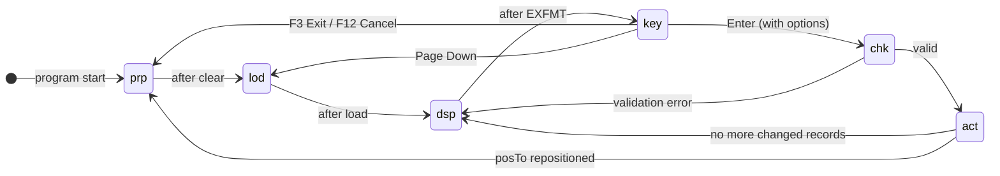
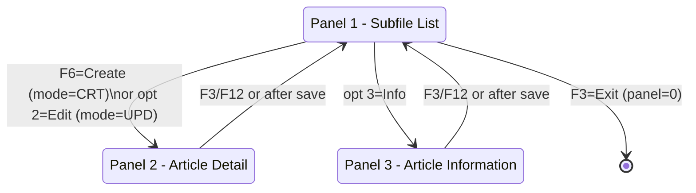

# ART200 - Work with Articles

## 1. Program Purpose and Display File

**Program:** `ART200` (`SAMSRC1/QRPGLESRC/ART200.SQLRPGLE`)  
**Display File:** [`ART200D`](../SAMCO/QDDSSRC/ART200D-Work_with_Article.DSPF) (`FART200D`)

`ART200` is the interactive article maintenance program. It provides a classic "Work with" interface for listing, creating, editing, soft-deleting, and viewing extended information for articles. It also navigates to the supplier association program (`ART201`).

The display file defines three screen formats and one subfile pair:

| Format  | Panel | Description                                      |
|---------|-------|--------------------------------------------------|
| `SFL01` / `CTL01` | 1 | Subfile list — browse articles with Position To  |
| `FMT02` | 2 | Article definition — create or edit an article   |
| `FMT03` | 3 | Article extended information — free-text notes   |

---

## 2. Panel-Step State Machine

The program uses a two-variable state machine: `panel` selects the active screen, and `step##` drives the processing phase within that screen. Each panel has its own independent step variable (`step01`, `step02`, `step03`).

### State Variables

| Variable | Type   | Initial | Description                              |
|----------|--------|---------|------------------------------------------|
| `panel`  | `3i 0` | `1`     | Active panel number (0 = exit)           |
| `step01` | `3`    | `prp`   | Phase for panel 1 (subfile list)         |
| `step02` | `3`    | `prp`   | Phase for panel 2 (article detail)       |
| `step03` | `3`    | `prp`   | Phase for panel 3 (article information)  |

### Step Constants

| Constant | Value | Meaning                                        |
|----------|-------|------------------------------------------------|
| `prp`    | `'prp'` | **Prepare** — initialise / clear the panel   |
| `lod`    | `'lod'` | **Load** — populate subfile from file        |
| `dsp`    | `'dsp'` | **Display** — write screen and wait for input |
| `key`    | `'key'` | **Key** — evaluate function keys             |
| `chk`    | `'chk'` | **Check** — validate user input              |
| `act`    | `'act'` | **Act** — apply database changes             |

### State Transition Diagram



### Panel Flow



---

## 3. Key Business Rules

### 3.1 VAT Calculation

The article detail screen (`FMT02`) displays a calculated "price with VAT" field:

- `ARVATCD` — VAT code entered on the article record, references `FVAT/VATDEF`.
- `VATRATE` and `VATDESC` — resolved from `VATDEF` and shown beside the VAT code (output-only).
- `WITHVAT` — sale price including VAT, displayed using `EDTCDE(2)` (output-only, same domain as `ARSALEPR`).

The VAT display fields are purely informational; the stored sale price (`ARSALEPR`) remains exclusive of VAT.

### 3.2 Soft-Delete (`ARDEL` field)

Articles are **never physically deleted**. Option `4` on the subfile performs a logical delete:

```rpgle
chain arid article1;
ardel = 'X';          // mark as deleted
armod = %timestamp(); // last-modified timestamp
armodid = user;       // last-modified user
update farti;
```

- `ARDEL = 'X'` indicates the record is deleted.
- The field is visible in the subfile list under the `Del` column so operators can see the soft-deleted status.
- No hard `DELETE` or `DLTOBJ` is ever issued against an article record.

### 3.3 Article Validation (Panel 2 — `s02chk`)

Two checks are enforced before an article is saved:

| Field     | Rule                                            | Error Indicator |
|-----------|-------------------------------------------------|-----------------|
| `ARDESC`  | Description must not be blank                   | `errDesc` (IN41) |
| `ARTIFA`  | Family code must exist (`existArtFam(artifa)`)  | `errFamilly` (IN40) |

If either check fails, `step02` is set back to `dsp` so the screen re-displays with the inline error message.

### 3.4 Auto-Increment Article ID (Create Mode)

When creating a new article, the program derives the next ID by reading the last record in the keyed file:

```rpgle
setgt *hival article1;
readp article1;
Newid = %dec(arid :6: 0) + 1;
arid = %editc(NewId:'X');
```

If a `write` fails (duplicate key), the ID is incremented again and the write is retried in a `dow %error` loop.

### 3.5 Article Information (Panel 3 — `artiinf` SQL table)

Extended free-text article notes are stored in the `artiinf` SQL table (not in the article physical file). Panel 3 uses embedded SQL:

- **Load (`s03prp`):** `SELECT ARTICLE_INFORMATION INTO :text FROM artiinf WHERE ARTICLE_INFO_ID = :arid` — if `SQLCODE <> 0` (no row), mode is set to `crt`.
- **Save (`s03act`):** Issues `UPDATE artiinf` or `INSERT INTO artiinf` depending on `mode`.

---

## 4. Files Used

| File          | RPG Name    | Usage            | Description                                    |
|---------------|-------------|------------------|------------------------------------------------|
| `ARTICLE`     | `article1`  | Update (`uf a e`) | Article master — keyed; used for chain, update, write |
| `ARTICLE`     | `article2`  | Input (`if e`)    | Article master — second open with `rename(farti:farti2)` for sequential subfile load |
| `ART200D`     | `art200d`   | Workstation (`cf e`) | Display file with subfile `SFL01`, formats `FMT02`, `FMT03` |
| `artiinf`     | *(SQL)*     | Read/Write (SQL)  | Article extended information table (embedded SQL) |
| `VATDEF`      | *(DDS ref)* | Output-only display | VAT rate and description — referenced in `FMT02` display fields |

### External Program Called

| Program  | Parameter | Purpose                                |
|----------|-----------|----------------------------------------|
| `ART201` | `arid`    | Navigate to supplier (provider) maintenance for the selected article (option 6) |

### Service Program Functions Used (via `/copy familly`)

| Function          | Returns  | Purpose                                      |
|-------------------|----------|----------------------------------------------|
| `getArtFamDesc`   | `50A`    | Get family description text from family code |
| `existArtFam`     | `N`      | Validate that a family code exists           |
| `sltArtFam`       | `3A`     | Prompt (F4) to select a family code          |
| `isArtFamDeleted` | `N`      | Check whether a family is soft-deleted       |
| `closeFAMILLY`    | *(none)* | Close the family file                        |
