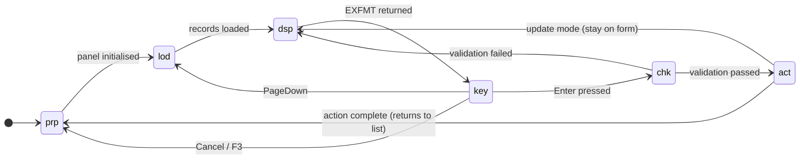

# ART200 – Article Maintenance Program

## 1. Program Purpose and Display File

`ART200` is an ILE RPG (SQLRPGLE) interactive program that provides full **article master maintenance** for the SAMCO application. It allows users to list articles, create new records, edit existing ones, soft-delete them, manage long-text information, and navigate to the related supplier maintenance program (`ART201`).

**Display file:** [`ART200D`](../SAMSRC1/QDDSSRC/ART200D.DSPF) (DSPF, 24x80)

The display file defines three screen formats:

| Format | Screen ID | Purpose |
|--------|-----------|---------|
| `CTL01` / `SFL01` | `ART200-1` | Subfile list — browse and select articles |
| `FMT02` | `ART200-2` | Article definition form — create / edit |
| `FMT03` | `ART200-3` | Article free-text information editor |

**Binding directory:** `SAMPLE`

---

## 2. Panel-Step State Machine

The program uses a two-variable state machine per panel. The outer variable `panel` selects the active screen; an inner `stepNN` variable drives the lifecycle of that panel through fixed phases.

### State variables

| Variable | Type | Initial value | Controls |
|----------|------|---------------|---------|
| `panel`  | `3i 0` | `1` | Which panel is active (1 = list, 2 = edit form, 3 = info editor, 0 = exit) |
| `step01` | `3A`   | `prp` | State of the subfile list panel |
| `step02` | `3A`   | `prp` | State of the article definition form |
| `step03` | `3A`   | `prp` | State of the article information editor |

### Step constants

| Constant | Value | Meaning |
|----------|-------|---------|
| `prp` | `'prp'` | **Prepare** – initialise/clear the panel before loading data |
| `lod` | `'lod'` | **Load** – read records into the subfile or fetch DB data |
| `dsp` | `'dsp'` | **Display** – write/EXFMT the screen format to the user |
| `key` | `'key'` | **Key** – evaluate function keys pressed after EXFMT |
| `chk` | `'chk'` | **Check** – validate input before acting |
| `act` | `'act'` | **Act** – commit the validated data to the database |

### State-transition diagram


```mermaid
stateDiagram-v2
    direction LR
    [*] --> prp
    prp --> lod   : panel initialised
    lod --> dsp   : records loaded
    dsp --> key   : EXFMT returned
    key --> chk   : Enter pressed
    key --> lod   : PageDown
    key --> prp   : Cancel / F3
    chk --> act   : validation passed
    chk --> dsp   : validation failed
    act --> prp   : action complete (returns to list)
    act --> dsp   : update mode (stay on form)
```

### Per-panel state flow summary

**Panel 1 – Subfile list (`step01`)**

- `prp` → clears the subfile, saves the current "position-to" value, resets RRN.
- `lod` → positions `ARTICLE2` via `(savdesc, savid)`, reads up to 14 records into `SFL01`, sets `SFLEND`.
- `dsp` → writes `KEY01` (function key legend), EXFMTs `CTL01`, captures last-read RRN.
- `key` → routes to: exit (panel=0), cancel (panel-1), F6 Create (panel=2, mode=CRT), PageDown (back to lod), Enter (to chk).
- `chk` → validates each changed subfile row; options 1 and 5 and any option > 6 are invalid (highlighted with reverse-image and error message).
- `act` → dispatches the valid option:
  - `2` = Edit → panel 2, mode UPD
  - `3` = Info → panel 3
  - `4` = Delete → soft-delete (see §3)
  - `6` = Suppliers → calls `ART201(arid)`

**Panel 2 – Article definition form (`step02`)**

- `prp` → for CRT: reads the highest `ARID`, increments by 1, resets the record. For UPD: chains `ARTICLE1` and loads the family description.
- `dsp` → EXFMTs `FMT02`.
- `key` → F3 exit (panel=1), F12 cancel (panel-1), F4 prompt (calls `sltArtFam` to pick a family), Enter (to chk).
- `chk` → validates: description (`ARDESC`) must not be blank; family (`ARTIFA`) must exist via `existArtFam()`.
- `act` → stamps `ARMOD`/`ARMODID`, writes (CRT) or updates (UPD) `FARTI`; on create, retries with `NewId+1` on duplicate-key error.

**Panel 3 – Article information editor (`step03`)**

- `prp` → SQL SELECT from `ARTIINF` by `ARID`; sets mode CRT or UPD.
- `dsp` → EXFMTs `FMT03` (1520-character free-text field).
- `key` → F3/F12 return to panel 1; Enter to chk.
- `chk` → no field-level validation (always advances to act).
- `act` → SQL UPDATE or INSERT into `ARTIINF`.

---

## 3. Key Business Rules

### 3a. VAT Calculation (display-only, FMT02)

The article definition screen shows a calculated **price including VAT** alongside the reference sale price:

- Field `ARVATCD` stores a single-character VAT code (ref: `SAMREF.VATCODE`, default `'2'`).
- `VATRATE` and `VATDESC` are display-only output fields sourced from `VATDEF` (ref format `FVAT`).
- `WITHVAT` is a display-only output field (same type as `ARSALEPR`, 7P2) formatted with edit code `2`, showing the VAT-inclusive price.
- The VAT rate is resolved via the `VATDEF` physical file keyed on `VATCODE`. The program does not calculate `WITHVAT` directly in source — it is carried via the display file field reference, which implies the value is pre-populated by the service program or a trigger before display.

### 3b. Soft-Delete (option 4)

Articles are never physically deleted. Option `4` on the subfile list executes:

```rpg
chain arid article1;
ardel = 'X';
armod = %timestamp();
armodid = user;
update farti;
```

- `ARDEL` is a 1-character field (`REFFLD(DLCODE)` in `SAMREF`, defined as `DLCODE 1A`).
- Setting `ARDEL = 'X'` marks the record as logically deleted.
- The deletion timestamp and user ID are recorded in `ARMOD` / `ARMODID`.
- The `ARDEL` column is visible in the subfile list (column header `'Del'`, position 70) so operators can see deleted articles.

### 3c. Article Validation (FMT02, `s02chk`)

Before writing or updating an article record, two validations are enforced:

1. **Description is mandatory** – if `ARDESC = ' '`, indicator `errDesc` (ind 41) is set ON, which triggers the inline error message `'A description is mandatory'` on the `ARDESC` field. The panel stays on `dsp`.

2. **Family must exist** – `existArtFam(artifa)` (boolean service-program procedure from `FAMILLY` binding) is called; if it returns `*off`, indicator `errFamilly` (ind 40) is set ON, which triggers `ERRMSGID(ERR0001 *LIBL/SAMMSGF)` on the `ARTIFA` field. The panel stays on `dsp`.

### 3d. Auto-increment Article ID (Create mode)

On `s02prp` in CRT mode:

```rpg
setgt *hival article1;
readp article1;
Newid = %dec(arid :6: 0) + 1;
arid  = %editc(NewId:'X');
```

`ARID` is a 6-character field treated as a zero-padded numeric string. The program reads the last record by key, converts to numeric, adds 1, and converts back. If a duplicate key occurs on `write(e) farti`, it retries by incrementing `NewId` in a `dow %error` loop.

### 3e. Position-To Navigation

The `POSTO` field (10A, input) on the subfile control record allows the user to type a partial description. On `s01prp`, `savDesc = posTo` seeds the `SETLL` on `ARTICLE2` (keyed by `ARDESC, ARID`), enabling alphabetical positioning within the list.

---

## 4. Files Used

| File | Type | Access | Key | Purpose |
|------|------|--------|-----|---------|
| `ARTICLE` (PF) | Physical file | — | — | Master article table (base for logical files) |
| `ARTICLE1` (LF) | Logical file — `FARTI` record format | Update (`uf a`) | `ARID` | Primary access for chain/update/write by article ID |
| `ARTICLE2` (LF) | Logical file — `FARTI` record format | Input (`if`) — renamed to `FARTI2` | `ARDESC, ARID` | Sequential read for subfile population in description order |
| `ART200D` (DSPF) | Workstation file | Combined (`cf`) | — | Interactive display file (subfile list + 2 detail formats) |
| `ARTIINF` (SQL table) | SQL table | Embedded SQL (`SELECT` / `INSERT` / `UPDATE`) | `ARTICLE_INFO_ID` | Long free-text information per article (up to 1520 chars) |
| `VATDEF` (PF) | Physical file | Read (display-file field reference) | `VATCODE` | VAT code lookup — rate and description shown on FMT02 |
| `FAMILLY` (PF) | Physical file | Via service program (`SAMPLE` bnddir) | `FAID` | Family existence check and description lookup |

### External Program Calls

| Program / Procedure | Type | Purpose |
|--------------------|------|---------|
| `ART201` | External program (`extpgm`) | Supplier-to-article maintenance; called with `ARID` on option 6 |
| `existArtFam(artifa)` | Service program procedure | Validates that a family code exists in `FAMILLY` |
| `getArtFamDesc(artifa)` | Service program procedure | Returns the 50-char description for a family code |
| `sltArtFam(artifa)` | Service program procedure | Interactive family code selector (F4 prompt on FMT02) |

---

## 5. Data Model Overview

```mermaid
erDiagram
    ARTICLE ||--o{ ARTICLE1 : "LF by ARID"
    ARTICLE ||--o{ ARTICLE2 : "LF by ARDESC+ARID"
    ARTICLE {
        char(6)   ARID
        char(50)  ARDESC
        char(3)   ARTIFA
        packed(7,2) ARSALEPR
        packed(7,2) ARWHSPR
        packed(5,0) ARSTOCK
        packed(5,0) ARMINQTY
        char(1)   ARVATCD
        char(1)   ARDEL
        date      ARCREA
        timestamp ARMOD
        char(11)  ARMODID
    }
    ARTIINF {
        char(6)      ARTICLE_INFO_ID
        varchar(1520) ARTICLE_INFORMATION
    }
    VATDEF {
        char(1)  VATCODE
        packed(4,2) VATRATE
        char(20) VATDESC
    }
    FAMILLY {
        char(3)  FAID
        char(50) FADESC
        char(1)  FAVATCD
        char(1)  FADEL
    }
    ARTICLE }o--|| FAMILLY : "ARTIFA = FAID"
    ARTICLE }o--|| VATDEF  : "ARVATCD = VATCODE"
    ARTICLE ||--o| ARTIINF : "ARID = ARTICLE_INFO_ID"
```
