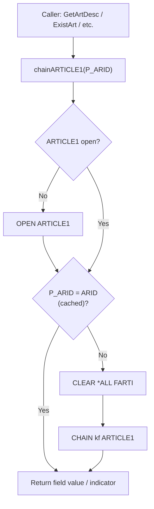

# ART300 — Technical Documentation

## 1. Program Purpose

**ART300** is an ILE RPG **service module** (`H NOMAIN`) that provides a reusable, cached-access API to the Articles master file. It is compiled into the **FARTICLE** service program, which is registered in the `SAMPLE` binding directory used across the SAMCO application.

There is **no display file** — ART300 is a data-access module with no user interface of its own. All exported procedures accept an article ID (`ARID`, 6A) as input and return a specific field value or indicator.

---

## 2. Architecture: Lazy-Open / Key-Cache Pattern

ART300 implements a **lazy-open, single-key cache** pattern to minimise redundant disk I/O across callers in the same activation group:

1. The file `ARTICLE1` is declared with `USROPN` — it is **not opened automatically** at program activation.
2. The internal procedure `chainARTICLE1` checks `%open(ARTICLE1)` before every CHAIN operation and opens the file on demand.
3. Before executing the CHAIN, it compares the requested key (`P_ARID`) with the currently cached key (`ARID`). If they match, the CHAIN is **skipped** and the already-loaded record is reused.
4. A companion procedure `closeARTICLE1` allows callers to explicitly close the file when done.



> **Note:** There is no panel/step state machine in ART300. That pattern belongs to interactive display programs; ART300 is a pure data-access service module.

---

## 3. Exported Procedures

All procedures are exported and prototyped in the copybook `SAMSRC1/QPROTOSRC/ARTICLE.RPGLEINC` (included via `/copy article`).

| Procedure | Return Type | Description |
|---|---|---|
| `GetArtDesc` | `50A` (char) | Returns the article description (`ARDESC`) |
| `GetArtRefSalPrice` | `7P 2` (packed) | Returns the reference sale price (`ARSALEPR`) |
| `GetArtStockPrice` | `7P 2` (packed) | Returns the warehouse/stock price (`ARWHSPR`) |
| `GetArtFam` | `3A` (char) | Returns the article family ID (`ARTIFA`) |
| `GetArtStock` | `5P 0` (packed) | Returns current stock quantity (`ARSTOCK`) |
| `GetArtMinStock` | `5P 0` (packed) | Returns minimum stock threshold (`ARMINQTY`) |
| `GetArtVatCode` | `1A` (char) | Returns the VAT code assigned to the article (`ARVATCD`) |
| `ExistArt` | `N` (indicator) | Returns `*ON` if article exists **and** is not soft-deleted (`ARDEL <> 'X'`) |
| `IsArtDeleted` | `N` (indicator) | Returns `*ON` if article is soft-deleted (`ARDEL = 'X'`) |

The following procedures are prototyped in the copybook but **not implemented** in ART300 (they are in other modules):

| Prototype | Return Type | Description |
|---|---|---|
| `SltArticle` | `6` (char) | Select an article (interactive selection — elsewhere) |
| `GetArtInfo` | `1520A` (char) | Get full article info string (elsewhere) |
| `CloseARTICLE1` | `(void)` | Explicitly closes ARTICLE1 (implemented in ART300) |

---

## 4. Key Business Rules

### 4.1 Soft-Delete Pattern

ART300 implements the SAMCO standard **soft-delete** convention:

- Field `ARDEL` (`REFFLD(DLCODE)`, 1A) stores `'X'` when an article has been logically deleted.
- `ExistArt` returns `*ON` only when the record is found **and** `ARDEL <> 'X'`.
- `IsArtDeleted` returns `*ON` when `ARDEL = 'X'`.
- Physical records are **never hard-deleted** through this module; logical deletion is enforced via the `ARDEL` flag.

### 4.2 Audit Stamping Fields

The `ARTICLE` physical file carries the SAMCO standard audit columns:

| Field | Type | Description |
|---|---|---|
| `ARCREA` | `L` (date) | Creation date — set on INSERT, never changed |
| `ARMOD` | `Z` (timestamp) | Last modification timestamp — updated on every change |
| `ARMODID` | `11A` (char) | User profile that last modified the record |

These fields are stored on the file but ART300 does not write audit stamps — it is a **read-only** access module (`ARTICLE1` is opened `IF` — input-only).

### 4.3 VAT Code

Each article carries a `ARVATCD` field (`REFFLD(VATCODE)`, 1A, default `'2'`) that links to the VAT rate table. The VAT rate itself is resolved by the `FVAT` service program via the `SAMPLE` binding directory; ART300 only surfaces the code.

### 4.4 Price Fields

Two price fields are maintained per article:

| Field | Maps to SAMREF | Description |
|---|---|---|
| `ARSALEPR` | `UNITPRICE` (7P 2) | Reference sale price (recommended retail) |
| `ARWHSPR` | `UNITPRICE` (7P 2) | Warehouse/cost price |

### 4.5 Stock Quantities

Three quantity fields are maintained per article:

| Field | Maps to SAMREF | Description |
|---|---|---|
| `ARSTOCK` | `QUANTITY` (5P 0) | Current physical stock |
| `ARMINQTY` | `QUANTITY` (5P 0) | Minimum stock threshold (reorder trigger) |
| `ARCUSQTY` | `QUANTITY` (5P 0) | Committed quantity (customer orders pending) |
| `ARPURQTY` | `QUANTITY` (5P 0) | Ordered quantity (purchase orders open) |

> `ARCUSQTY` and `ARPURQTY` are present on the physical file but **not exposed** by any ART300 exported procedure.

---

## 5. Files Used

| File | Type | Physical File | Open Mode | Key Field(s) | Description |
|---|---|---|---|---|---|
| `ARTICLE1` | Logical file (LF) | `ARTICLE` (PF) | Input (`IF`), `USROPN` | `ARID` (6A, `UNIQUE`) | Key-by-article-ID view of the Articles master; record format `FARTI` |

### 5.1 ARTICLE Physical File — Field Summary

All fields reference their types from `SAMREF` (the SAMCO reference file) unless otherwise noted.

| Field | Type | Source | Description |
|---|---|---|---|
| `ARID` | `6A` | `SAMREF.ARID` | Article ID (primary key) |
| `ARDESC` | `50A` | `SAMREF.ARDESC` | Article description |
| `ARSALEPR` | `7P 2` | `SAMREF.UNITPRICE` | Reference sale price |
| `ARWHSPR` | `7P 2` | `SAMREF.UNITPRICE` | Warehouse / cost price |
| `ARTIFA` | `3A` | `SAMREF.FAID` | Article family ID |
| `ARSTOCK` | `5P 0` | `SAMREF.QUANTITY` | Current stock quantity |
| `ARMINQTY` | `5P 0` | `SAMREF.QUANTITY` | Minimum stock quantity |
| `ARCUSQTY` | `5P 0` | `SAMREF.QUANTITY` | Customer order committed qty |
| `ARPURQTY` | `5P 0` | `SAMREF.QUANTITY` | Purchase order open qty |
| `ARVATCD` | `1A` | `SAMREF.VATCODE` | VAT code (default `'2'`) |
| `ARCREA` | `L` (date) | Direct | Creation date |
| `ARMOD` | `Z` (timestamp) | Direct | Last modification timestamp |
| `ARMODID` | `11A` | Direct | Last modified by (user profile) |
| `ARDEL` | `1A` | `SAMREF.DLCODE` | Soft-delete flag (`'X'` = deleted) |

### 5.2 ARTICLE1 Logical File

```
UNIQUE
R FARTI   PFILE(ARTICLE)
K ARID
```

A simple unique-key logical file over `ARTICLE`, keyed by `ARID`. This is the only file opened by ART300.

---

## 6. Source Members Summary

| Member | Library/File | Type | Description |
|---|---|---|---|
| `ART300` | `SAMSRC1/QRPGLESRC` | `RPGLE` | Service module source (this program) |
| `ARTICLE` | `SAMSRC1/QPROTOSRC` | `RPGLEINC` | Prototype copybook (`/copy article`) |
| `ARTICLE` | `SAMSRC1/QDDSSRC` | `PF` | Articles master physical file DDS |
| `ARTICLE1` | `SAMSRC1/QDDSSRC` | `LF` | Articles logical file keyed by `ARID` |
| `SAMREF` | `SAMSRC1/QDDSSRC` | `PF` | SAMCO reference file (field type definitions) |
| `SAMPLE` | `SAMSRC1/QBNDSRC` | `BNDDIR` | Binding directory — includes `FARTICLE *SRVPGM` |

---

## 7. Deployment Context

ART300 compiles into the **FARTICLE** service program, registered in the `SAMPLE` binding directory alongside other SAMCO data-access service programs (`FCUSTOMER`, `FFAMILLY`, `FPARAMETER`, `FPROVIDER`, `FVAT`, `FCOUNTRY`, `LOG`, `ORDER`, etc.).

Any ILE program bound to the `SAMPLE` binding directory can call the `GetArt*`, `ExistArt`, and `IsArtDeleted` procedures directly after including the `/copy article` copybook.
