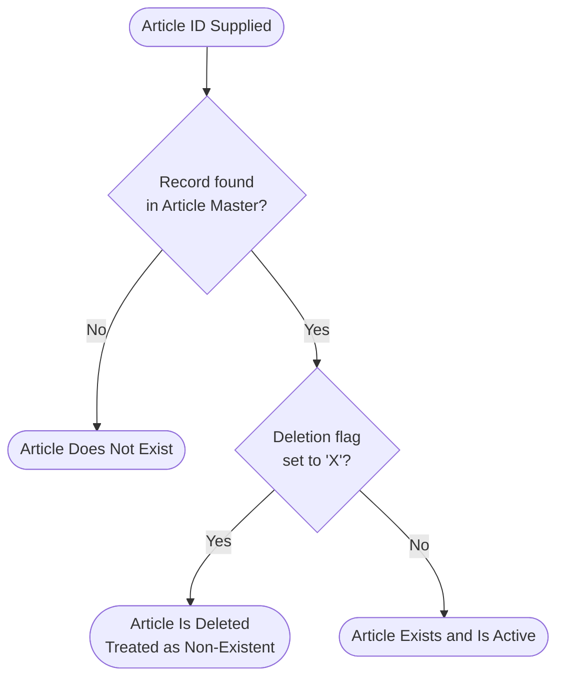
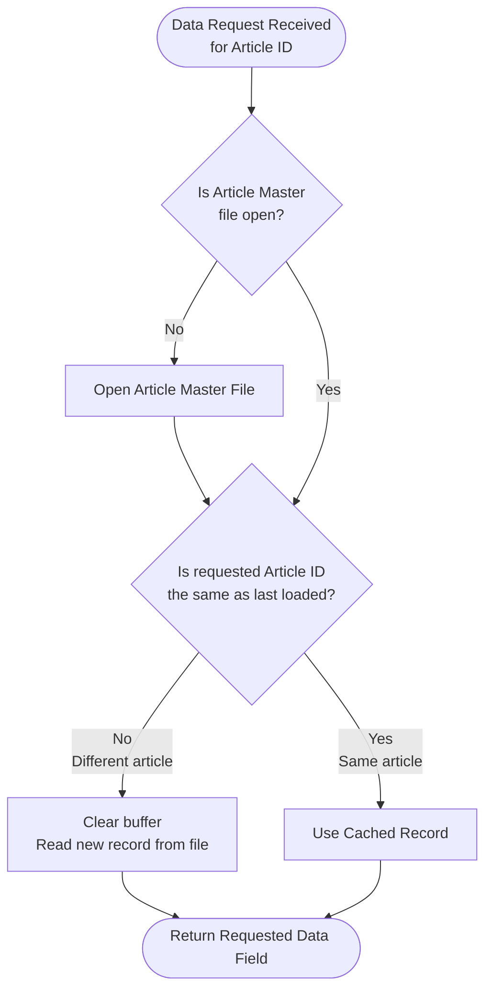
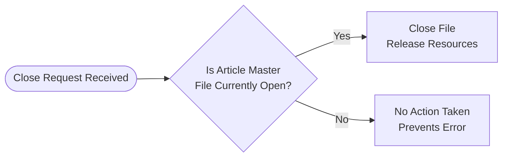

# ART300 — Article Master Data Service
## Business Rules Report

---

# 1. Executive Summary

**Program:** ART300 — Article Master Data Service

ART300 serves as the central data access service for article (product) master information within the inventory and sales management environment. Rather than a transactional program, it functions as a **shared data service module** — a reusable library of business functions called by other programs throughout the system whenever article information is needed.

The program consolidates all read access to the article master into a single, authoritative service layer. Any part of the business system that needs to know an article's description, pricing, stock levels, product family, tax code, or active status routes that request through ART300. This design ensures that article data is always retrieved consistently, with built-in safeguards against accessing deleted or non-existent articles.

**Key Business Functions provided by ART300:**

- **Article Existence & Status Checking** — Determines whether an article is active and available for use in transactions, or has been logically removed from the catalogue
- **Article Description Retrieval** — Supplies the article's display name for use in documents, screens, and reports
- **Pricing Information** — Exposes both the reference sale price and the internal warehouse (stock) price for financial processing
- **Stock Level Monitoring** — Provides current stock quantities and minimum stock thresholds for inventory management decisions
- **Product Classification** — Returns the product family/category code for grouping and reporting purposes
- **Tax Code Lookup** — Returns the VAT code assigned to each article, driving tax calculations at point of sale

ART300 operates against a single article master file (`ARTICLE1`) using an efficient caching mechanism — if the same article is requested multiple times in succession, the file is only read once, improving performance across high-volume calling processes.

---

# 2. Detailed Business Rules

## Inventory Domain

### Article Record Retrieval with Smart Caching

**Category:** Business Process
**Domain:** Inventory

**Description:** When any calling program requests article data, ART300 fetches the corresponding article master record. To optimise performance, if the same article ID is requested consecutively, the previously loaded record is reused without re-reading the file. The file itself is opened automatically on first use.

**Trigger Conditions:**
- A request is made for data associated with a specific article ID
- The article ID being requested is different from the one most recently loaded

**Business Outcome:**
- The article master record is loaded into memory and made available for all subsequent data-retrieval functions
- If the article ID has not changed, the cached record is used, avoiding unnecessary file reads

**Related Data:** `ARTICLE1.ARID` (Article ID key)

---

### Article Description Retrieval

**Category:** Business Process
**Domain:** Inventory

**Description:** Returns the full descriptive name of an article (up to 50 characters) for a given article ID. This description is used in customer-facing documents, internal screens, and reports wherever the article's name must be displayed.

**Trigger Conditions:**
- A valid 6-character article ID is supplied by the calling program

**Business Outcome:**
- The article's description text is returned to the calling program

**Related Data:** `ARTICLE.ARDESC` (Article Description)

---

### Stock Level Retrieval

**Category:** Business Process
**Domain:** Inventory

**Description:** Provides two key stock figures for any given article: the **current quantity on hand** and the **minimum stock threshold**. These values support inventory replenishment decisions and stock availability checks across the system.

**Trigger Conditions:**
- A valid 6-character article ID is supplied

**Business Outcome:**

| Function | Data Returned | Field | Size |
|---|---|---|---|
| Current Stock | Quantity currently held in warehouse | `ARTICLE.ARSTOCK` | 5-digit integer |
| Minimum Stock | Threshold below which replenishment is triggered | `ARTICLE.ARMINQTY` | 5-digit integer |

---

### Product Family / Category Retrieval

**Category:** Business Process
**Domain:** Inventory

**Description:** Returns the product family code that classifies an article into a product category. This 3-character code is used for grouping articles in reports, applying category-level pricing rules, and managing product hierarchies.

**Trigger Conditions:**
- A valid 6-character article ID is supplied

**Business Outcome:**
- The article's 3-character family/category code is returned to the calling program

**Related Data:** `ARTICLE.ARTIFA` (Article Family ID)

---

### Article File Resource Management

**Category:** Business Process
**Domain:** Inventory

**Description:** The article master file is opened automatically when first needed and closed safely when the calling process is finished. The close operation checks whether the file is open before acting, preventing system errors from redundant close attempts.

**Trigger Conditions:**
- **Open:** First article data request within a calling session
- **Close:** Calling program signals it has finished using article data

**Business Outcome:**
- File resources are allocated only while needed and released cleanly upon completion

**Related Data:** `ARTICLE1` (Article Master File)

---

## Financial Domain

### Article Pricing Retrieval

**Category:** Business Process
**Domain:** Financial

**Description:** Provides two distinct pricing figures for any article: the **reference sale price** (the standard price at which the article is sold to customers) and the **stock/warehouse price** (the internal cost or warehouse valuation price). Both prices carry two decimal places for monetary precision.

**Trigger Conditions:**
- A valid 6-character article ID is supplied

**Business Outcome:**

| Function | Data Returned | Field | Format |
|---|---|---|---|
| Reference Sale Price | Standard customer-facing sale price | `ARTICLE.ARSALEPR` | 7 digits, 2 decimal places |
| Warehouse / Stock Price | Internal cost / warehouse valuation | `ARTICLE.ARWHSPR` | 7 digits, 2 decimal places |

---

### VAT Code Retrieval

**Category:** Business Process
**Domain:** Financial

**Description:** Returns the VAT (Value Added Tax) code assigned to an article. This single-character code maps to a VAT rate table used by sales and billing processes to calculate the correct tax amount applicable to each article sold.

**Trigger Conditions:**
- A valid 6-character article ID is supplied

**Business Outcome:**
- The article's VAT code is returned; the calling program uses this to look up and apply the correct tax rate

**Related Data:** `ARTICLE.ARVATCD` (VAT Code, 1-character reference to VAT rate table)

---

# 3. Validations and Exceptions

## Article Existence Validation

**Purpose:** Prevents the system from processing transactions against articles that do not exist or have been removed from the active catalogue.

**Rule:** An article is considered **valid and active** only when **both** of the following conditions are true:

1. A master record for the article ID is found in the article master file
2. The article has **not** been flagged as logically deleted (deletion code is not set to `X`)

**Failure Outcomes:**

| Condition | Result | Business Impact |
|---|---|---|
| Article ID not found in master file | Article reported as non-existent | Calling program cannot proceed with this article |
| Article found but marked as deleted | Article reported as non-existent | Deleted articles are treated identically to missing ones |
| Both conditions met | Article confirmed as active | Calling program may proceed with the article |

**Related Data:** `ARTICLE1.ARID`, `ARTICLE.ARDEL`

---

## Logical Deletion Check

**Purpose:** Supports a **soft-delete** approach to article management. Rather than physically removing article records, the business marks them as deleted using a flag. This preserves historical data (e.g., past orders referencing the article) while preventing new transactions.

**Rule:** An article is considered **logically deleted** when its deletion code field (`ARDEL`) is set to the value `X`.

**Outcomes:**

| Deletion Flag Value | Meaning | System Behaviour |
|---|---|---|
| `X` | Article is logically deleted | Treated as inactive; not available for new transactions |
| Any other value (including blank) | Article is active | Available for normal processing |

**Related Data:** `ARTICLE.ARDEL` (references deletion code master — `DLCODE`)

---

# 4. Calculation Rules

ART300 is a **data retrieval service** — it does not perform business calculations itself. All values returned are stored figures read directly from the article master record. Calculations using these values (e.g., applying VAT to a sale price, comparing stock to minimum thresholds) are performed by the calling programs that consume ART300's services.

The pricing fields returned use a standardised monetary format (7 digits, 2 decimal places) consistent with the system-wide `UNITPRICE` reference field, ensuring arithmetic consistency across all programs that perform price calculations.

| Data Point | Source Field | Format | Used For |
|---|---|---|---|
| Reference Sale Price | `ARTICLE.ARSALEPR` | 7 digits, 2 decimal | Sales order pricing, quotations |
| Warehouse / Stock Price | `ARTICLE.ARWHSPR` | 7 digits, 2 decimal | Internal valuation, cost calculations |
| Current Stock Quantity | `ARTICLE.ARSTOCK` | 5-digit integer | Stock availability checks |
| Minimum Stock Quantity | `ARTICLE.ARMINQTY` | 5-digit integer | Replenishment threshold comparisons |

---

# 5. Decision Logic

## Article Validity Decision

When a calling program asks "Does this article exist?", ART300 applies a two-condition check before confirming the article as active.

---

## Article Data Retrieval Decision

Every time a data request arrives, ART300 decides whether a new file read is necessary or whether the cached record can be reused.

---

## File Lifecycle Decision

---

# 6. Data Integrity Rules

## Article Master File (ARTICLE1 / ARTICLE)

| Rule | Field | Constraint | Business Reason |
|---|---|---|---|
| Article ID is the unique key | `ARTICLE.ARID` | 6-character key — one record per article | Ensures every article has a single, unambiguous master record |
| Deletion flag controlled vocabulary | `ARTICLE.ARDEL` | Only `X` signifies deletion; blank = active | Prevents ambiguous deletion states; historically derived from `DLCODE` reference table |
| Sale price monetary format | `ARTICLE.ARSALEPR` | 7 digits, 2 decimal places — matches `UNITPRICE` standard | Ensures pricing arithmetic is consistent across all system modules |
| Warehouse price monetary format | `ARTICLE.ARWHSPR` | 7 digits, 2 decimal places — matches `UNITPRICE` standard | Same monetary precision standard for internal valuations |
| Stock quantities are whole numbers | `ARTICLE.ARSTOCK`, `ARTICLE.ARMINQTY` | 5-digit integers (no decimals) | Physical stock units are always whole items |
| VAT code is a single-character reference | `ARTICLE.ARVATCD` | 1-character code — must resolve in VAT rate table | Guarantees every article has a deterministic tax classification |
| Family code is a 3-character reference | `ARTICLE.ARTIFA` | 3-character code — references product family master (`FAID`) | Maintains referential integrity with the product category hierarchy |

## Soft-Delete Pattern

The article master employs a **logical deletion** strategy rather than physical record removal. Setting `ARDEL = 'X'` renders an article invisible to all active business processes while preserving the record for historical reporting and audit purposes. This is a deliberate data integrity design ensuring that historical transactions (orders, invoices) referencing a deleted article continue to resolve correctly.

## File Access Safety

ART300 enforces two defensive access rules at the file level:
- **Open guard:** The article master file is only opened if it is not already open, preventing duplicate open errors in shared-use scenarios
- **Close guard:** The file is only closed if it is confirmed open, preventing errors when close is called redundantly

---

# 7. Business Process Flow

ART300 operates as a **service module** rather than a standalone process. The following describes its operational lifecycle as invoked by a calling program (e.g., a sales order entry, invoicing, or stock management program).

---

### 1. Service Initialisation (First Request)
- A calling program requests article data for the first time
- ART300 detects that the article master file is not yet open
- The file is opened automatically — no manual setup required by the caller
- The requested article record is loaded into a working buffer

---

### 2. Article Validation (On Demand)
- Before processing any article in a transaction, the calling program may ask ART300 to confirm the article is active
- ART300 checks: (a) does the record exist? and (b) is it free of the deletion mark?
- Only articles passing **both** checks are confirmed as valid for use in new transactions
- Logically deleted articles are rejected at this stage, preventing invalid transactions

---

### 3. Data Retrieval (Repeated Calls)
- The calling program requests specific article attributes as needed throughout its process:

| Step | Data Retrieved | Business Use |
|---|---|---|
| 3a | Article Description | Display on screen, document, or report |
| 3b | Reference Sale Price | Price the customer will be charged |
| 3c | Warehouse / Stock Price | Internal cost used for margin or valuation |
| 3d | Current Stock Quantity | Check availability before confirming order |
| 3e | Minimum Stock Quantity | Flag replenishment need post-transaction |
| 3f | Product Family Code | Apply category rules, reporting grouping |
| 3g | VAT Code | Calculate applicable tax for billing |

- If the same article is queried repeatedly, ART300's caching mechanism serves responses from the in-memory buffer, eliminating redundant file reads

---

### 4. Article Switch (Change of Article)
- When the calling program moves to a different article, ART300 detects the article ID change
- The working buffer is cleared and a fresh record is loaded from the file
- All subsequent data requests are served from the newly loaded record

---

### 5. Service Closure (End of Process)
- When the calling program has finished processing, it signals ART300 to release file resources
- ART300 confirms the file is open before closing it, ensuring a clean and error-free shutdown

---

### Integration Points

| Integrated Element | Nature | Direction |
|---|---|---|
| `ARTICLE1` — Article Master File | Physical data store (database file) | Read-only by ART300 |
| VAT Rate Table (`VATCODE`) | Reference table for VAT code validation | Indirect — VAT code is returned to caller for resolution |
| Product Family Master (`FAID`) | Reference table for family classification | Indirect — family code is returned to caller for resolution |
| Calling Programs (sales, stock, billing) | Any program requiring article master data | ART300 is called as a subroutine/service module |

---

# 8. Assumptions and Notes

## Explicit Rules (Confirmed in Source Code)

| Rule | Basis |
|---|---|
| Deletion flag value `X` marks an article as logically deleted | Directly coded: `ARDEL = 'X'` |
| Both record existence AND non-deletion are required for an article to be "active" | Directly coded: `%found(ARTICLE1) AND ARDEL <> 'X'` |
| File is opened on demand if not already open before first read | Directly coded: `if not %open(ARTICLE1) -> open` |
| File is closed only when confirmed open | Directly coded: `if %open(ARTICLE1) -> close` |
| Record buffer is cleared before each new article read | Directly coded: `clear *all FARTI` before keyed read |
| Caching: article record is not re-read if the article ID has not changed | Directly coded: `if P_ARID <> ARID -> read` |
| Sale and warehouse prices use 2 decimal places | Confirmed by physical file field definition referencing `UNITPRICE` |
| Stock quantities are whole numbers (5-digit integers) | Confirmed by physical file field definition |
| VAT code is a 1-character reference value | Confirmed by physical file field definition referencing `VATCODE` |
| Family code is a 3-character reference value | Confirmed by physical file field definition referencing `FAID` |

---

## Inferred Rules (Deduced from Code Patterns)

| Inferred Rule | Reasoning |
|---|---|
| ART300 is a **shared service module**, not a standalone program | All procedures are query/return functions with no user interface or output files |
| The article ID is a **6-character alphanumeric** key | Input parameter defined as 6-character in all procedure signatures |
| ART300 is **read-only** — it never updates article data | No write, update, or delete operations exist anywhere in the program |
| The caching mechanism is **session-scoped** — one article held in memory at a time | Only a single buffer is used; switching articles replaces the buffer entirely |
| Calling programs are responsible for acting on validation results | ART300 returns TRUE/FALSE indicators; it does not halt or raise errors directly |

---

## Assumptions Made During Analysis

| Assumption | Context |
|---|---|
| The term "article" is equivalent to "product" or "item" in business terminology | Derived from field names and context — stakeholders should confirm preferred terminology |
| `ARDEL = 'X'` is the **only** deletion mechanism | No other deletion-related fields or conditions were observed; confirm no secondary deletion flags exist |
| The VAT code returned by ART300 is resolved to a rate percentage by the **calling program** | ART300 returns only the code; the rate lookup is assumed to occur elsewhere |
| The family code returned is resolved to a family name/description by the **calling program** | Same pattern as VAT code — ART300 is a code-only service |

---

## Ambiguities Requiring Business Stakeholder Clarification

| Ambiguity | Question |
|---|---|
| **Warehouse price vs. Sale price** | Is `ARWHSPR` the purchase cost, an internal transfer price, or a warehouse-specific customer price? |
| **Minimum stock threshold ownership** | Is `ARMINQTY` managed centrally per article, or does it vary by warehouse location? |
| **Deleted article re-activation** | Is there a business process to re-activate a logically deleted article (i.e., remove the `X` flag)? |
| **Article ID format** | The 6-character article ID appears to be free-form. Are there formatting or numbering conventions? |

---

## Technical Limitations for Business Review

| Item | Note |
|---|---|
| **Single-record cache** | ART300 holds only one article in memory at a time. Programs that interleave requests for multiple articles in alternating sequence will incur repeated file reads, negating the caching benefit. |
| **No error signalling on missing articles** | If an article ID is not found, ART300 returns default/blank values rather than raising an explicit error. Calling programs must proactively call the existence check to avoid silently processing blank data. |
| **Read-only access** | ART300 cannot be used to create, update, or delete article records. Article master maintenance requires a separate program. |
